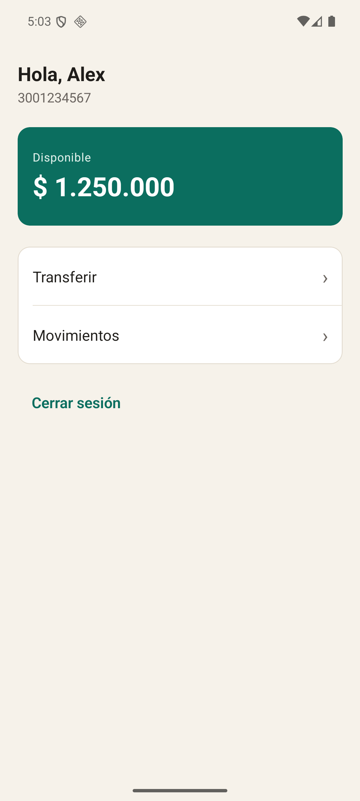
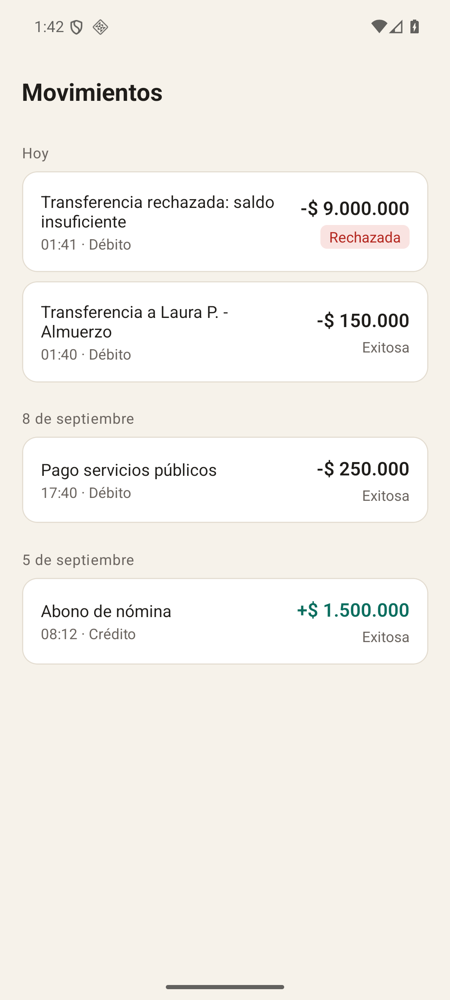

# Billetera

App Android en Kotlin que hospeda cuatro bundles de React Native: Login, Home, Transferencia y
Movimientos. Android manda en la navegación, la sesión y las llaves; los bundles pintan y hablan por
el puente, con los payloads cifrados en los dos sentidos.

  

## Cómo correrlo

Versiones con las que está probado:

- Node 24.18.0, npm 11.19.0
- JDK 17 (Temurin 17.0.20), con `JAVA_HOME` apuntando ahí
- Android SDK en `C:\Android\Sdk`: plataforma 36, build-tools 36.0.0, `minSdk 26`
- Gradle 8.14.3 (el wrapper del repo), React Native 0.81.6, React 19.1.4
- AVD `anden_demo`: Pixel 6, `android-36 / google_apis / x86_64`, sin Play Store, como `emulator-5554`

```bash
npm ci
npm run bundles          # metro + hermesc, deja los cuatro .android.bundle en assets
cd android
.\gradlew installDebug   # en Linux o macOS: ./gradlew installDebug
```

Los bundles compilados están commiteados, así que `installDebug` corre sin pasar por
`npm run bundles`; toca repetirlo al cambiar `src/` o `entries/`, porque el plugin de Gradle tiene
todas las variantes en `debuggableVariants` para no empaquetar JS por su cuenta.
`android/local.properties` no va al repo: si Gradle no halla el SDK, es la línea
`sdk.dir=C:/Android/Sdk`. Para volver al estado inicial, con sesión borrada y saldos de fábrica:

```bash
adb shell pm clear com.asuarez.billetera
```

## Usuarios de prueba

| Celular | Clave | Nombre | Estado | Saldo |
|---|---|---|---|---|
| 3001234567 | Clave123 | Alex Suárez | ACTIVO | $ 1.250.000 |
| 3109876543 | Clave123 | Laura Pérez | ACTIVO | $ 480.000 |
| 3157654321 | Clave123 | Carlos Gómez | INACTIVO | $ 90.000 |

Las claves están aquí porque el backend es un mock y hay que poder probarlo; en el dispositivo solo
queda el hash PBKDF2 (`data/DatosSemilla.kt`). Carlos sirve para el rechazo por cuenta inactiva.

## Cómo está organizado

```
android/app/src/main/java/com/asuarez/billetera/
├── splash/     splash nativo: diagnostica root/emulador y decide si abre Login o Home
├── bundles/    una Activity por bundle, cada una con su propio host de React Native
├── bridge/     el módulo nativo BilleteraBridge, los nombres de evento y el emisor hacia JS
├── security/   Keystore, AES-GCM, almacenamiento cifrado, hash de claves, root/emulador
├── session/    la sesión y su ciclo de vida: crear, validar, expirar, cerrar
├── data/       el backend simulado: usuarios, movimientos, reglas de negocio y persistencia
└── nav/, error/  los intents entre pantallas y la pantalla de "Algo salió mal"
android/app/src/main/assets/bundles/  los cuatro bundles ya compilados a bytecode Hermes
entries/ y scripts/                   registro de cada bundle y la generación con hermesc
src/shared/                           cliente del puente, cifrado, tema y componentes comunes
src/bundles/                          las cuatro pantallas de React Native
__tests__/ y test-vectors/            pruebas Jest y el vector AES-GCM común a Kotlin y JS
docs/                                 los entregables en PDF, los diagramas de draw.io y las capturas
```

## El puente y el cifrado

Al arrancar el proceso, Android genera 32 bytes con `SecureRandom` y esa es la llave del canal. Se la
entrega al bundle una sola vez, en las props iniciales (`claveCanal`), junto con el nombre del
bundle, `esDebug` y la versión. No se persiste, no se escribe en logs y se rota al volver a Login por
logout o por expiración. De JS a Android van llamadas al módulo `BilleteraBridge`: `login`,
`registrar`, `buscarDestino`, `transferir`, `movimientos` y `send`. De Android a JS, eventos por
`emitDeviceEvent` que el bundle escucha con `DeviceEventEmitter`. En ambos sentidos el payload es un
envelope `{"iv":"...","data":"..."}` de AES-256-GCM, IV de 12 bytes y tag de 128 bits; el IV lo pide
JS a `randomBytes` porque el `SecureRandom` bueno está del lado nativo. En claro van solo los nombres
de evento y los códigos de error. Que los dos lados cifren igual no queda a la confianza:
`test-vectors/aes-gcm.json` fija llave, IV y texto, y `BridgeEnvelopeTest` en Kotlin y
`crypto.test.ts` en Jest comprueban que sale el mismo `data`. Los flujos, en
[docs/Documento de arquitectura.pdf](docs/Documento%20de%20arquitectura.pdf).

## Decisiones que tomé

**React Native 0.81.6 con `newArchEnabled=false`.** El enunciado pide Bridge, Native Modules y
EventEmitter por su nombre, y eso es la arquitectura clásica. Descarté la nueva arquitectura con
TurboModules: más moderna, y menos parecida a lo que se está evaluando.

**Un host de React Native por bundle.** Cada Activity crea su `BundleHost` y lo destruye en
`onDestroy`, así que Movimientos carga solo el bytecode de Movimientos. La alternativa era un host
único con los cuatro componentes en un bundle solo: ahorra memoria y deja de ser cuatro bundles.

**Almacenamiento cifrado propio.** `SecureStore` guarda `base64(iv).base64(ct)` en SharedPreferences
normales, con una llave AES-256 que vive en el Android Keystore y no sale de ahí. Jetpack Security
(`EncryptedSharedPreferences`) está deprecado y sin reemplazo, y una dependencia muerta en una app
financiera no se defiende.

**`minSdk 26`.** PBKDF2WithHmacSHA256, `java.time` y `java.util.Base64` son nativos desde Android
8.0. Con 21 tocaba desugaring y una librería de criptografía aparte, para ganar un tramo de mercado
que a estas alturas ya casi no existe.

**Root y emulador.** Solo bloquea si hay señales de root, no es emulador y el build es release. Las
imágenes `google_apis` son builds `userdebug`: en el emulador la app muestra las señales y deja
continuar para poder evaluar; en un teléfono real con root el release se cierra. Play Integrity es el
complemento que iría en producción, porque es lo único que no se engaña desde el dispositivo.

**`FLAG_SECURE` solo en release.** Ahí me tropecé: quise sacar las capturas contra el APK release y
salieron todas en negro, que es justo lo que hace `FLAG_SECURE`. Las capturas de `docs/evidencia/`
son del APK debug; el flujo del release lo verifiqué pantalla por pantalla leyendo el árbol de UI con
`uiautomator`, ya con el código ofuscado.

## Pruebas

```bash
npm run typecheck                    # tsc --noEmit, 0 errores
npm run lint                         # eslint, 0 errores y 0 avisos
npm test                             # 8 suites, 43 pruebas, 43 en verde
cd android
.\gradlew testDebugUnitTest          # 40 pruebas, 0 fallos, 0 errores, 1 omitida
.\gradlew connectedDebugAndroidTest  # 13 pruebas en 8 clases, todas en verde
```

La omitida es a propósito: el generador de los hashes semilla vive en `PasswordHasherTest` y solo
corre con `-Dsemilla=true`, para no rehacer PBKDF2 en cada build. Las instrumentadas necesitan el
emulador encendido y los bundles en assets, y tardan unos 25 segundos. Salidas y capturas en
[docs/Evidencia de pruebas.pdf](docs/Evidencia%20de%20pruebas.pdf).

## APK

`.\gradlew assembleRelease` desde `android/` deja `app/build/outputs/apk/release/app-release.apk`,
unos 47 MB con las cuatro ABI adentro. R8 corre con `minifyEnabled` y `shrinkResources`, y el
`mapping.txt` queda en `app/build/outputs/mapping/release/`. La firma sale de
`android/keystore.properties`, que con el `.jks` está en `.gitignore`; sin ese archivo el build no
falla, cae al `signingConfig` de depuración con un aviso en consola, que fue lo que me pasó la
primera vez y por lo que generé un keystore aparte. El APK firmado va en Releases del repositorio.

## Limitaciones conocidas

El backend es un mock en proceso: `BancoMockApi` resuelve todo en el dispositivo y `MockDb` guarda el
estado cifrado en las mismas SharedPreferences, con una latencia falsa de 200 a 400 ms en login y
transferencia. No hay red, y el APK release ni siquiera pide el permiso de INTERNET.

La llave del canal viaja una vez por las props iniciales, del lado nativo al motor de JS dentro del
mismo proceso. Eso cubre lo que pide el enunciado (que los payloads no queden legibles en un log, en
un volcado o en las herramientas que leen el tráfico del puente), pero no a alguien que ya controla
el proceso: si lo controla, también tiene la llave. Con backend real seguiría un ECDH por sesión.

Movimientos no pagina: trae todo lo del usuario y agrupa por día en memoria. La expiración se mide
contra el reloj del dispositivo, así que cambiar la hora del teléfono alarga o acorta la sesión; el
TTL es de 2 minutos en debug y 10 en release, para poder verla sin esperar tanto.

La detección de root es heurística: binarios `su` en las rutas conocidas, `test-keys` en `Build.TAGS`,
tres paquetes de gestores conocidos y un par de propiedades del sistema. Un Magisk bien escondido
pasa sin que la app se entere, y eso no se arregla agregando más rutas a la lista.
